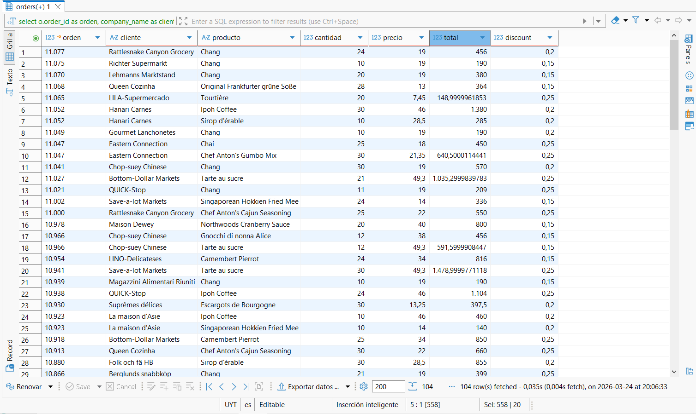

# 📈 Análisis de Rentabilidad y Consultas Avanzadas 

## 🎯 Desafíos Resueltos
En este repositorio se documenta la resolución de 4 ejercicios clave que abarcan:
* **Vinculación de Datos**: Identificación de clientes sin pedidos activos mediante `LEFT JOIN`.
* **Segmentación de Productos**: Filtrado avanzado por patrones de nombres y rangos de precios.
* **Cálculos de Negocio**: Determinación de montos totales por pedido (`Quantity * UnitPrice`).
* **Calidad de Datos**: Detección de valores nulos en la cadena de suministro.

---

## 📊 Evidencias de Ejecución (Resultados)

He organizado las capturas de pantalla de los resultados para que puedas consultarlas de forma ordenada:

  
🔍 (Joins)

   
  
En esta consulta se identificaron los clientes que no han realizado transacciones, validando la integridad de la relación entre tablas.

  
  
  

  
🎯 Filtrado de Productos (Like/Between)

   
  
Aplicación de filtros específicos para segmentar el catálogo de productos según requerimientos de marketing.

  

  
💰 Rentabilidad por Pedido (Cálculos)

   
  
Cálculo dinámico de ingresos por línea de producto, fundamental para reportes de ventas.

  

  
🛠️ Auditoría de Proveedores (Is Null)

   
  
Detección de productos huérfanos de proveedor para asegurar la continuidad de la cadena de suministro.

  

---

## 💡 Aprendizajes Técnicos
Para ver el detalle de los conceptos aplicados y las conclusiones de negocio de este proyecto, consulta el archivo de **[Conclusiones Técnicas](./results/conclusiones.md)** en la carpeta de resultados.

---
🚀 *Proyecto desarrollado como parte de mi formación como Analista de Datos.*
